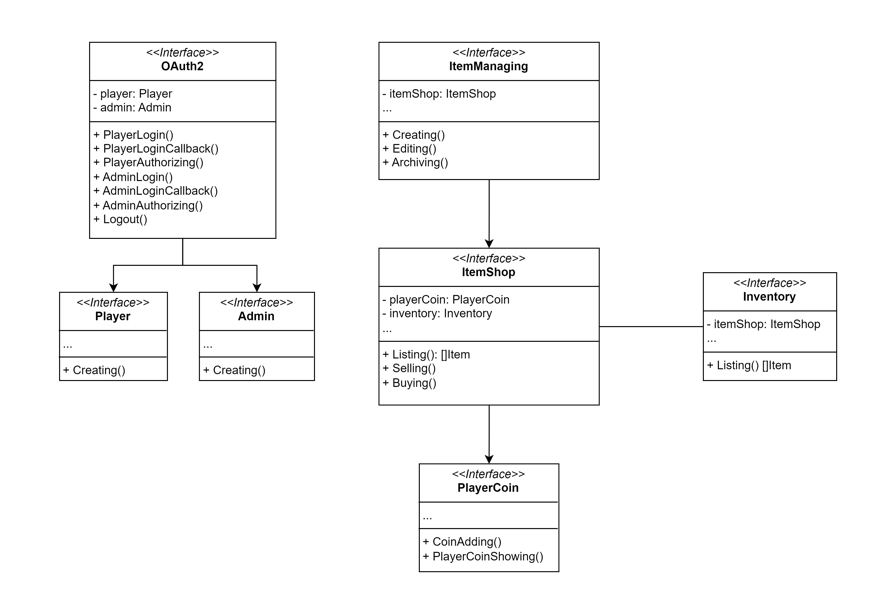
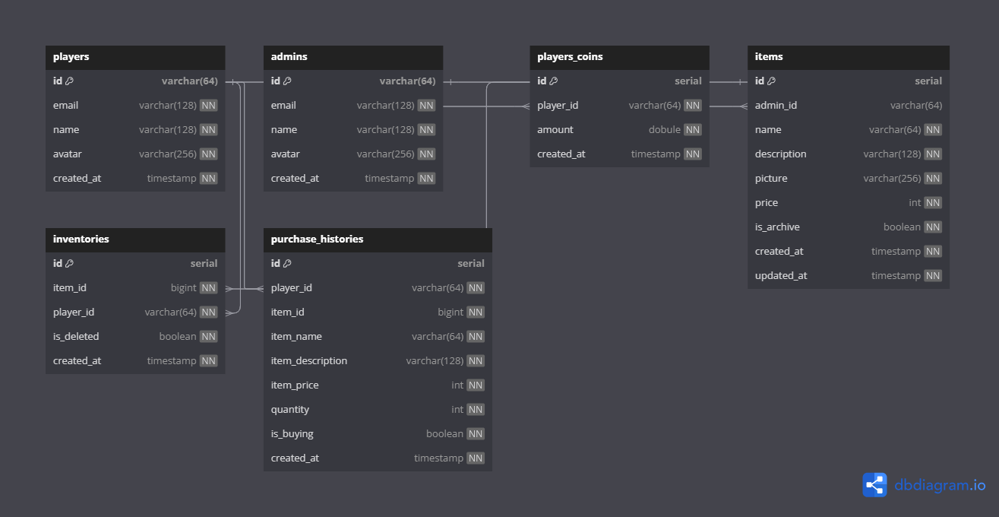

# Shop API

**Published by** Pakphom Promsean.

## About Shop API

So this project is going to act like CRUD project + OAuth2.

## Features of Shop API

- Item Shop
  - Listing
  - Selling
  - Buying
- Item Managing
  - Creating
  - Editing
  - Archiving
- Inventory
  - Listing
- Player Coin
  - Coin Adding
  - Showing
- OAuth2
  - Player Login
  - Admin Login
  - Logout
  - Middleware
    - Player Authorize
    - Admin Authorize

## Architecture



## ER Diagram



## Start PostgreSQL on Docker

1. Pull the PostgreSQL image

   ```bash
   docker pull postgres:alpine
   ```

2. Start the PostgreSQL container

   ```bash
   docker run --name shopdb -p 5432:5432 -e POSTGRES_PASSWORD=123456 -d postgres:alpine
   ```

3. Create the Shop Database

   ```bash
   docker exec -it shopdb bash
   ```

   ```bash
   psql -U postgres
   ```

   ```bash
   CREATE DATABASE shopdb;
   ```

4. In case you need to delete the database

   ```bash
   DROP DATABASE shopdb;
   ```

## Database Migration

```bash
go run ./databases/migration/migratedb.go
```

## config.yaml Example

```bash
server:
  port: 8080
  allowOrigins:
    - "*"
  bodyLimit: "10M" # MiB
  timeout: 30 # Seconds

oauth2:
  playerRedirectUrl: "http://localhost:8080/v1/oauth2/google/player/login/callback"
  adminRedirectUrl: "http://localhost:8080/v1/oauth2/google/admin/login/callback"
  clientId: "xxxxx.apps.googleusercontent.com"
  clientSecret: "xxxxx"
  endpoints:
    authUrl: "https://accounts.google.com/o/oauth2/auth?access_type=offline&approval_prompt=force"
    tokenUrl: "https://oauth2.googleapis.com/token"
    deviceAuthUrl: "https://oauth2.googleapis.com/device/code"
  scopes:
    - "https://www.googleapis.com/auth/userinfo.email"
    - "https://www.googleapis.com/auth/userinfo.profile"
  userInfoUrl: "https://www.googleapis.com/oauth2/v2/userinfo"
  revokeUrl: "https://accounts.google.com/o/oauth2/revoke"

database:
  host: localhost
  port: 5432
  user: postgres
  password: 168
  dbname: shopdb
  sslmode: disable
  schema: public
```

## Start Shop API using Docker

Let's see the IPv4 of our database container first by this follwing command.

```bash
docker network inspect bridge
```

Then copy the IPv4 of shopdb to change the host of database in the config.yaml.

And now let's build and start the shop-api through the Docker.

```bash
docker build -t shop-api:v1.0.0 .
```

```bash
docker run --name shop-api -v /path/to/config-folder:/app/etc -d shop-api:v1.0.0
```

## Postman Collection and ENV

- [Collection](./postman/shop-api.postman_collection.json)
